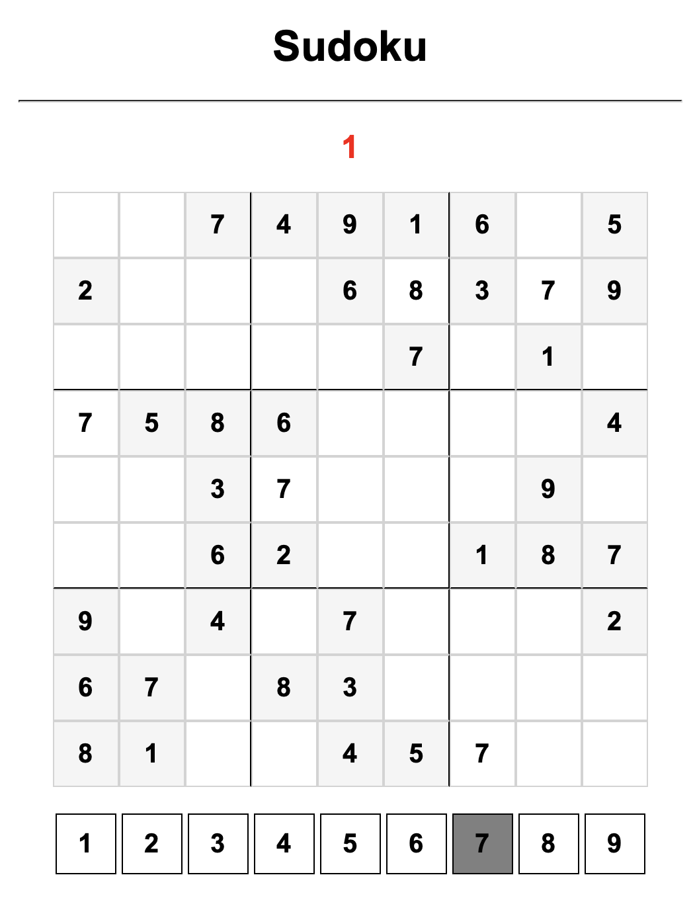

# Sudoku Game

## Overview

A web-based Sudoku game built with HTML, CSS, and JavaScript. Players solve a 9×9 Sudoku puzzle by selecting numbers and placing them into empty cells while the application validates each move against the puzzle solution.

## Features

- Interactive 9×9 Sudoku board
- Number selection interface
- Real-time answer validation
- Error counter for incorrect moves
- Pre-filled puzzle clues
- Simple and responsive design

## Technologies

- HTML5
- CSS3
- JavaScript (ES6)

## Project Structure

```text
Sudoku-Game/
│
├── index.html
├── index.js
├── style.css
├── sudoku.png
└── README.md
```

## Installation and Setup

### Clone the Repository

```bash
git clone https://github.com/Salmah1/Sudoku-Game.git
cd Sudoku-Game
```

### Run the Application

Open `index.html` in your web browser.

## How to Play

1. Select a number from the digit panel below the board.
2. Click an empty tile on the Sudoku board.
3. If the selected number is correct, it will be placed in the tile.
4. If the selected number is incorrect, the error counter will increase.
5. Continue filling the board until the puzzle is completed.

## Game Rules

- Each row must contain the numbers 1–9 without repetition.
- Each column must contain the numbers 1–9 without repetition.
- Each 3×3 section must contain the numbers 1–9 without repetition.
- Pre-filled cells cannot be modified.

## Screenshot


